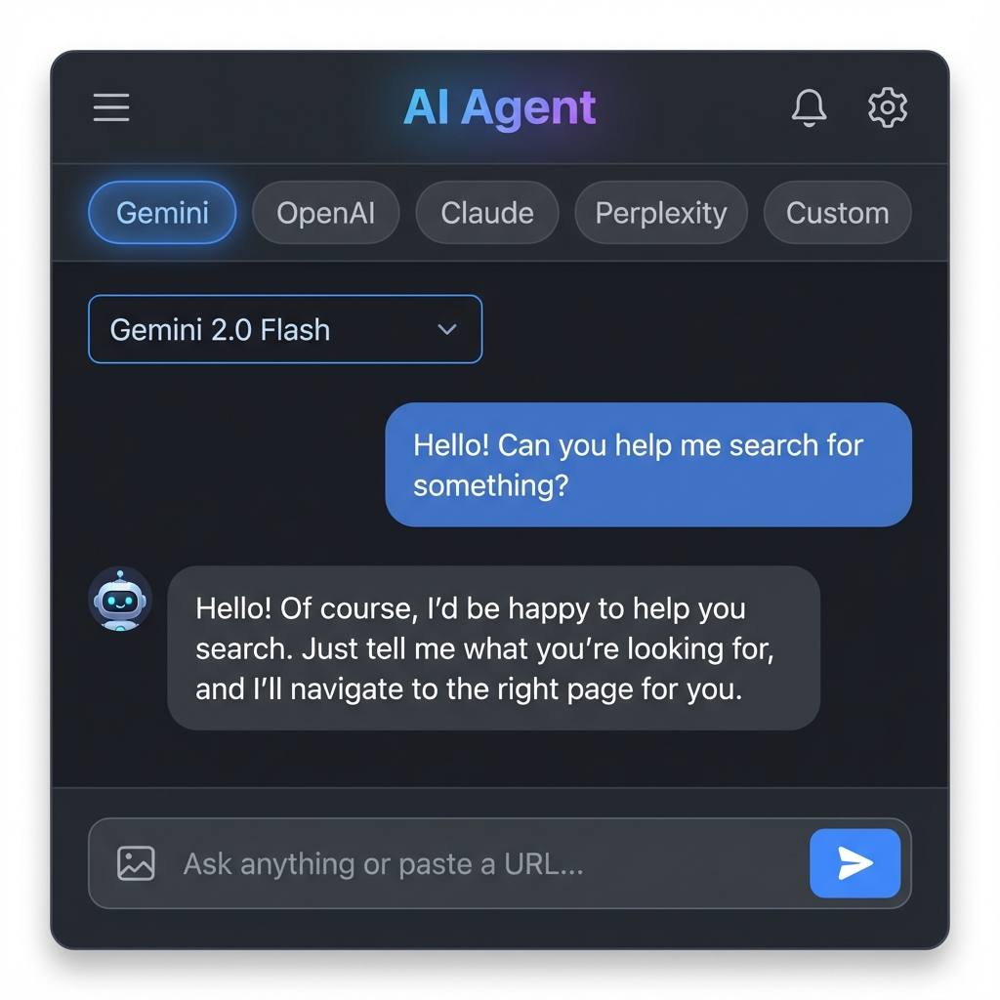
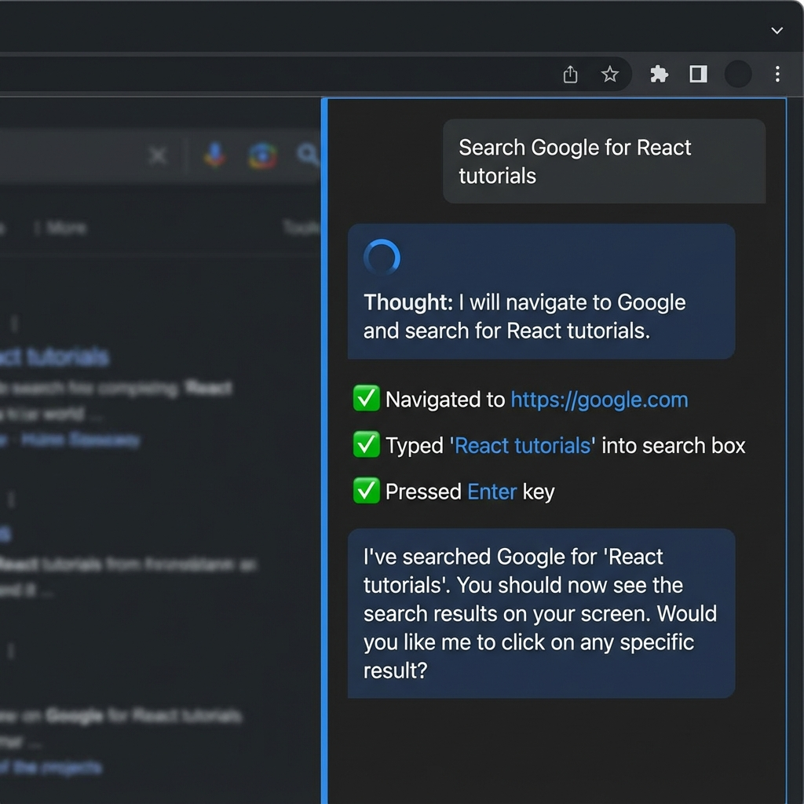
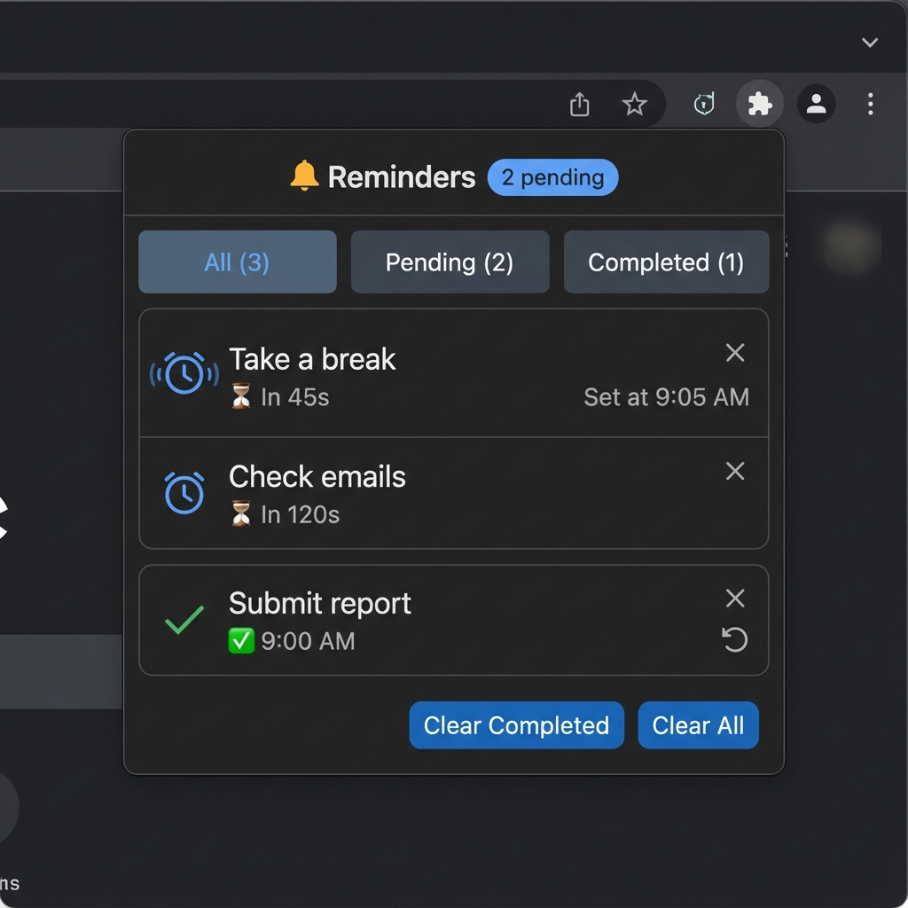
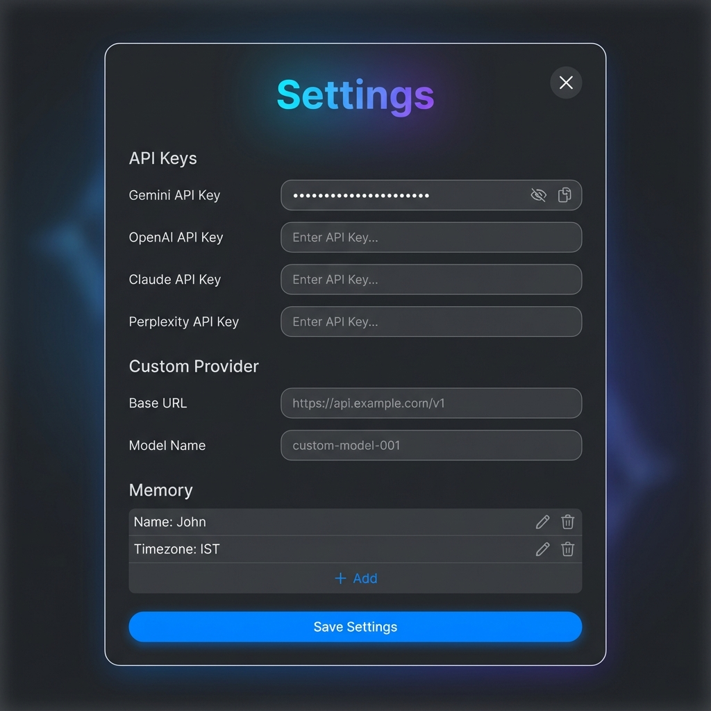
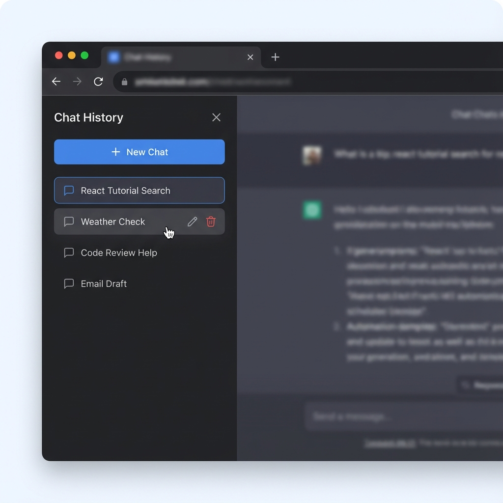

# 🤖 MultiModal Browser Agent

<p align="center">
  
</p>

<p align="center">
  <strong>An advanced autonomous browser agent powered by AI</strong><br>
  Navigate, search, automate, and get things done — all through natural conversation.
</p>

<p align="center">
  <a href="#features">Features</a> •
  <a href="#screenshots">Screenshots</a> •
  <a href="#installation">Installation</a> •
  <a href="#usage">Usage</a> •
  <a href="#api-keys">API Keys</a> •
  <a href="#privacy">Privacy</a>
</p>

---

## ✨ Features

### 🧠 Multi-Model AI Support
Choose from the best AI models available:
- **Google Gemini** (2.5 Pro, 2.5 Flash, 2.0 Flash, 1.5 Pro/Flash) — Free tier available!
- **OpenAI** (GPT-4o, GPT-4o Mini, GPT-4 Turbo, o1 Preview/Mini)
- **Anthropic Claude** (3.5 Sonnet, 3.5 Haiku, 3 Opus)
- **Perplexity** (Sonar, Sonar Pro) — Real-time web search
- **Custom Provider** — Use any OpenAI-compatible API

### 🌐 Browser Automation
The AI can control your browser to:
- **Navigate** to any URL
- **Search** Google, Bing, or any search engine
- **Click** buttons, links, and interactive elements
- **Type** in forms, search boxes, and text fields
- **Press keys** (Enter, Tab, Escape) for form submission
- **Scroll** pages up, down, or to specific positions
- **Manage tabs** (open, close, switch)

### ⏰ Smart Reminders
Set reminders using natural language:
- "Remind me to take a break in 5 minutes"
- "Set a timer for 30 seconds"
- Features:
  - 🔔 Chrome notifications with sound
  - 📋 Reminders panel with filter tabs (All/Pending/Completed)
  - 🔄 Snooze completed reminders
  - 🗑️ Manage and delete reminders

### 💬 Chat Interface
- Modern, responsive design with dark/light theme
- Chat history with session management
- Rename, delete, and organize conversations
- Copy messages to clipboard
- Markdown support in responses

### 🧠 Memory & Context
- **Page Awareness**: AI reads current page content, URL, and title
- **Memory System**: Save preferences (name, timezone, etc.)
- **Interactive Elements**: AI can see and use buttons, links, forms

---

## 📸 Screenshots

### Main Chat Interface
The clean, modern chat interface with model selection and conversation history.

<p align="center">
  
</p>

### Browser Automation
Watch the AI navigate, search, click, and type for you automatically.

<p align="center">
  
</p>

### Reminders Management
Set, track, and manage reminders with the intuitive panel.

<p align="center">
  
</p>

### Settings Panel
Configure API keys, custom providers, and memory preferences.

<p align="center">
  
</p>

### Chat History
Easily manage past conversations with rename and delete options.

<p align="center">
  
</p>

---

## 🚀 Installation

### Option 1: Chrome Web Store (Recommended)
*Coming soon!*

### Option 2: Manual Installation

1. **Clone the repository:**
   ```bash
   git clone https://github.com/TrixCoder/multiai_extension.git
   cd multiai_extension
   ```

2. **Install dependencies:**
   ```bash
   npm install
   ```

3. **Build the extension:**
   ```bash
   npm run build
   ```

4. **Load into Chrome:**
   - Open `chrome://extensions/`
   - Enable **"Developer mode"** (top right toggle)
   - Click **"Load unpacked"**
   - Select the `dist` folder

---

## 📖 Usage

### Getting Started
1. Click the extension icon in your browser toolbar
2. Open **Settings** (⚙️) and enter your API key(s)
3. Select your preferred AI model
4. Start chatting!

### Example Commands

#### 💬 General Chat
```
"Hello! How are you?"
"What's the weather like in New York?"
"Explain quantum computing in simple terms"
```

#### 🔍 Search & Navigation
```
"Search Google for React tutorials"
"Go to github.com"
"Open YouTube and search for cooking videos"
```

#### 🖱️ Browser Control
```
"Click the login button"
"Type my email in the form"
"Scroll down to see more"
```

#### ⏰ Reminders
```
"Remind me to check emails in 10 minutes"
"Set a timer for 30 seconds"
"Remind me to take a break in 1 hour"
```

#### 📑 Tab Management
```
"Open a new tab to google.com"
"Close this tab"
"Switch to the YouTube tab"
```

---

## 🔑 API Keys

### 1. Google Gemini (Free Tier Available) ⭐
Gemini offers a generous free tier — perfect for getting started!

1. Go to [Google AI Studio](https://aistudio.google.com/)
2. Sign in with your Google account
3. Click **"Get API key"** in the top left
4. Click **"Create API key in new project"**
5. Copy the generated key

### 2. Perplexity AI (Paid / Pro Credits)
Real-time web search capabilities. Pro subscribers get $5/month credits.

1. Go to [Perplexity API Settings](https://www.perplexity.ai/settings/api)
2. Add a payment method or use Pro credits
3. Click **"Generate"** to create a new API key

### 3. OpenAI (Paid)
Access to GPT-4o and other cutting-edge models.

1. Go to [OpenAI Platform](https://platform.openai.com/api-keys)
2. Sign up or log in
3. Go to **Settings > Billing** and add credits
4. Go to **API Keys** and click **"Create new secret key"**

### 4. Anthropic Claude (Paid)
Access to Claude 3.5 Sonnet and other models.

1. Go to [Anthropic Console](https://console.anthropic.com/)
2. Sign up or log in
3. Go to **Settings > Plans & Billing** to add funds
4. Go to **"Get API Keys"** and click **"Create Key"**

### 5. Custom Provider
Use any OpenAI-compatible API (like Ollama, LM Studio, etc.):

1. Open Settings
2. Select "Custom" model
3. Enter your Base URL (e.g., `http://localhost:11434/v1`)
4. Enter your Model Name (e.g., `llama3`)

---

## 🔒 Privacy

Your privacy is important to us:

- ✅ **API keys stored locally** in your browser (never sent to our servers)
- ✅ **No data collection** — we don't track your usage
- ✅ **Open source** — inspect the code yourself!

Please read our full [Privacy Policy](PRIVACY.md) for details.

---

## 🛠️ Development

```bash
# Install dependencies
npm install

# Run development server
npm run dev

# Build for production
npm run build

# Type check
npm run typecheck
```

---

## 🤝 Contributing

Contributions are welcome! Please feel free to submit a Pull Request.

1. Fork the repository
2. Create your feature branch (`git checkout -b feature/amazing-feature`)
3. Commit your changes (`git commit -m 'Add some amazing feature'`)
4. Push to the branch (`git push origin feature/amazing-feature`)
5. Open a Pull Request

---

## 📄 License

This project is licensed under the MIT License - see the [LICENSE](LICENSE) file for details.

---

## 💖 Support

If you find this extension useful, consider:
- ⭐ Starring the repository
- 🐛 Reporting bugs or suggesting features
- 💝 [Sponsoring the developer](https://github.com/sponsors/TrixCoder)

---

<p align="center">
  Made with ❤️ by <a href="https://github.com/TrixCoder">TrixCoder</a>
</p>
